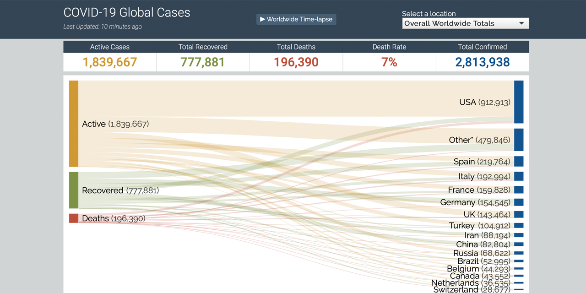

# COVID-19 sankey visualization
<!-- ALL-CONTRIBUTORS-BADGE:START - Do not remove or modify this section -->
[](#contributors-)
<!-- ALL-CONTRIBUTORS-BADGE:END -->

 [](https://app.netlify.com/sites/covid-sankey-viz/deploys)

A responsive D3-based data visualization that leverages a <a href="https://www.data-to-viz.com/graph/sankey.html">Sankey diagram</a> to display the breakdown of the worldwide COVID-19 cases.

This visualization uses a JSON endpoints provide by [@pomber](https://github.com/pomber/covid19/) and [@NovelCOVID](https://github.com/NovelCOVID/API) which serves data derived from the [Johns Hopkins Center of Systems Science and Engineering dataset](https://github.com/CSSEGISandData/COVID-19).

[](https://covid.lonnygomes.com)

## Development

You can hack on this locally by cloning down the repository and launching a local server via npm.

```bash
npm install
npm start
```

## Contributing

Pull request and feedback is welcome and requested.

## Contributors ✨

Thanks goes to these wonderful people ([emoji key](https://allcontributors.org/docs/en/emoji-key)):

<!-- ALL-CONTRIBUTORS-LIST:START - Do not remove or modify this section -->
<!-- prettier-ignore-start -->
<!-- markdownlint-disable -->
<table>
  <tr>
    <td align="center"><a href="http://lonnygomes.com"><br /><sub><b>Lonny Gomes</b></sub></a><br /><a href="https://github.com/LonnyGomes/covid-sankey-vizualization/commits?author=LonnyGomes" title="Code">💻</a> <a href="#maintenance-LonnyGomes" title="Maintenance">🚧</a></td>
    <td align="center"><a href="https://github.com/kmliebe"><br /><sub><b>kmliebe</b></sub></a><br /><a href="#design-kmliebe" title="Design">🎨</a> <a href="#ideas-kmliebe" title="Ideas, Planning, & Feedback">🤔</a></td>
    <td align="center"><a href="https://github.com/panoz7"><br /><sub><b>panoz7</b></sub></a><br /><a href="#ideas-panoz7" title="Ideas, Planning, & Feedback">🤔</a></td>
    <td align="center"><a href="https://github.com/pawn002"><br /><sub><b>J. Z. Rioflorido</b></sub></a><br /><a href="#ideas-pawn002" title="Ideas, Planning, & Feedback">🤔</a> <a href="#design-pawn002" title="Design">🎨</a> <a href="#a11y-pawn002" title="Accessibility">️️️️♿️</a></td>
    <td align="center"><a href="https://pomb.us"><br /><sub><b>Rodrigo Pombo</b></sub></a><br /><a href="#data-pomber" title="Data">🔣</a></td>
    <td align="center"><a href="https://github.com/NovelCOVID"><br /><sub><b>NovelCOVID</b></sub></a><br /><a href="#data-NovelCOVID" title="Data">🔣</a></td>
    <td align="center"><a href="http://coreygearhart.com"><br /><sub><b>Corey Gearhart</b></sub></a><br /><a href="#ideas-coreygearhart" title="Ideas, Planning, & Feedback">🤔</a> <a href="#a11y-coreygearhart" title="Accessibility">️️️️♿️</a></td>
  </tr>
  <tr>
    <td align="center"><a href="https://github.com/kelissa"><br /><sub><b>kelissa</b></sub></a><br /><a href="#design-kelissa" title="Design">🎨</a> <a href="#ideas-kelissa" title="Ideas, Planning, & Feedback">🤔</a></td>
    <td align="center"><a href="https://github.com/COBAcode"><br /><sub><b>Corey B</b></sub></a><br /><a href="#ideas-COBAcode" title="Ideas, Planning, & Feedback">🤔</a></td>
  </tr>
</table>

<!-- markdownlint-enable -->
<!-- prettier-ignore-end -->
<!-- ALL-CONTRIBUTORS-LIST:END -->

This project follows the [all-contributors](https://github.com/all-contributors/all-contributors) specification. Contributions of any kind welcome!